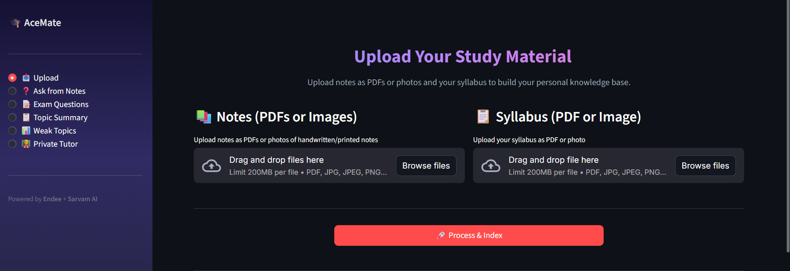

# 🎓 AceMate

**AI-Powered Exam Preparation Assistant** — Upload your notes and syllabus, then let AI help you study smarter with Q&A, predicted exam questions, topic summaries, and adaptive MCQ practice.

**[👉 Try Live Demo](https://acemate.dpdns.org/)** 🚀

---

## 🧩 Problem Statement

Students spend hours re-reading notes without knowing what to focus on. **AceMate** solves this by:
- Turning PDFs into a searchable vector knowledge base
- Answering questions backed by your actual notes
- Predicting exam questions so you study what matters
- Tracking weak topics and generating targeted practice quizzes

---

## 🏗️ System Architecture

```
┌──────────────────────────────────────────────────────────┐
│                    Streamlit UI (app.py)                  │
│  ┌──────────┬──────────┬──────────┬──────────┬─────────┐ │
│  │  Upload  │  Ask Q&A │  Exam Qs │  Summary │  Weak   │ │
│  │          │          │          │          │ Topics  │ │
│  └────┬─────┴────┬─────┴────┬─────┴────┬─────┴────┬────┘ │
│       │          │          │          │          │       │
│  ┌────▼──────────▼──────────▼──────────▼──────────▼────┐ │
│  │              features.py + retriever.py              │ │
│  │     (RAG Q&A, Exam Prediction, Summaries, MCQs)     │ │
│  └────────────┬──────────────────────┬─────────────────┘ │
│               │                      │                   │
│  ┌────────────▼────────┐  ┌──────────▼─────────────────┐ │
│  │    embedder.py      │  │      tracker.py            │ │
│  │  sentence-transformers │  │  (JSON score persistence) │ │
│  │  + PyMuPDF parsing  │  └────────────────────────────┘ │
│  └────────────┬────────┘                                 │
│               │                                          │
│  ┌────────────▼────────┐  ┌────────────────────────────┐ │
│  │    ingest.py        │  │      Sarvam AI (LLM)       │ │
│  │  (PDF → Chunks →   │  │  sarvam-m via REST API     │ │
│  │   Embed → Endee)   │  │  OpenAI-compatible format  │ │
│  └────────────┬────────┘  └────────────────────────────┘ │
│               │                                          │
│  ┌────────────▼─────────────────────────────────────────┐ │
│  │              Endee Vector Database                    │ │
│  │  (384-dim cosine index, INT8 precision, metadata)    │ │
│  └──────────────────────────────────────────────────────┘ │
└──────────────────────────────────────────────────────────┘
```

---

## 🔧 How Endee is Used

[Endee](https://github.com/endee-io/endee) is used as the **vector database** for storing and searching study material:

| Operation | Description |
|-----------|-------------|
| **Create Index** | `examprep` index with 384 dimensions, cosine similarity, INT8 precision |
| **Upsert** | Store PDF chunks as vectors with metadata (source file, page range, topic, type) |
| **Query** | Semantic search — embed a question, find the most relevant chunks |
| **Metadata** | Each vector carries `source_file`, `chunk_index`, `page_range`, `topic`, `type` |

The Python SDK (`pip install endee`) provides a clean interface:
```python
from endee import Endee, Precision
client = Endee()
client.create_index(name="examprep", dimension=384, space_type="cosine", precision=Precision.INT8)
index = client.get_index(name="examprep")
index.upsert([{"id": "chunk_1", "vector": [...], "meta": {"text": "...", "topic": "..."}}])
results = index.query(vector=[...], top_k=5)
```

---

## 🤖 How Sarvam AI is Used

[Sarvam AI](https://www.sarvam.ai/) provides the **sarvam-m** LLM via an OpenAI-compatible REST API:

- **Q&A**: Given retrieved note chunks as context, answers questions strictly from your notes
- **Exam Question Prediction**: Analyzes notes to generate 5 likely exam questions with type and difficulty
- **Topic Summarization**: Produces 5-point bullet summaries from your notes
- **MCQ Generation**: Creates 5 MCQs with options, correct answers, and explanations
- **Topic Extraction**: Parses syllabus text to identify distinct academic topics

All calls use the standard chat completion format:
```python
POST https://api.sarvam.ai/v1/chat/completions
{
  "model": "sarvam-m",
  "messages": [{"role": "system", "content": "..."}, {"role": "user", "content": "..."}],
  "max_tokens": 1000,
  "temperature": 0.7
}
```

---

## 📁 Project Structure

```
examprep-ai/
├── app.py            # Streamlit UI — 5-page sidebar navigation
├── ingest.py         # PDF → chunk → embed → store in Endee
├── embedder.py       # Sentence-transformer embeddings + PDF parsing
├── retriever.py      # Semantic search over Endee index
├── features.py       # 4 core AI features via Sarvam AI
├── tracker.py        # Weak topic tracker with JSON persistence
├── requirements.txt  # Python dependencies
├── .env.example      # Environment variable template
└── README.md         # This file
```

---

## 🚀 Setup Instructions

### Prerequisites
- **Python 3.9+**
- **Docker** (for running Endee)
- **Sarvam AI account** (for the API key)

### Step 1: Clone & Install Dependencies

```bash
cd examprep-ai
pip install -r requirements.txt
```

### Step 2: Start Endee Vector Database

Create a `docker-compose.yml` in a separate directory:

```yaml
services:
  endee:
    image: endeeio/endee-server:latest
    container_name: endee-server
    ports:
      - "8080:8080"
    ulimits:
      nofile: 100000
    environment:
      NDD_NUM_THREADS: 0
      NDD_AUTH_TOKEN: ""
    volumes:
      - endee-data:/data
    restart: unless-stopped

volumes:
  endee-data:
```

```bash
docker compose up -d
```

Verify Endee is running:
```bash
docker ps  # Should show endee-server
```

### Step 3: Get Sarvam AI API Key

1. Visit [https://www.sarvam.ai/](https://www.sarvam.ai/)
2. Sign up / Log in to the developer dashboard
3. Navigate to **API Keys** section
4. Create a new API key
5. Copy the key

### Step 4: Configure Environment

```bash
cp .env.example .env
```

Edit `.env` with your values:
```env
SARVAM_API_KEY=your_actual_api_key_here
ENDEE_URL=http://localhost:8080
ENDEE_AUTH_TOKEN=
```

### Step 5: Launch the App

```bash
streamlit run app.py
```

The app will open at `http://localhost:8501`.

---

## 🎮 Demo Walkthrough

### 1️⃣ Upload Notes

Navigate to **📤 Upload** in the sidebar. You'll see:



**Features:**

- **📚 Notes Section** — Upload your study materials (PDFs or photos of handwritten/printed notes)
  - Supports multiple files
  - Drag & drop or browse files
  - Limit: 200MB per file
  
- **📋 Syllabus Section** — Upload your course syllabus (PDF or image)
  - Single file upload
  - Used to extract topics automatically
  
- **🚀 Process & Index Button** — Starts the ingestion pipeline
  - Extracts text from PDFs/images using OCR
  - Chunks text into 500-1000 token pieces
  - Converts chunks into 384-dimensional embeddings
  - Stores vectors in Endee with metadata (file, page range, topic)
  - Shows progress as chunks are indexed

**Privacy Note:** After uploading, click **"🗑️ Clear All Notes"** at the bottom before leaving to prevent other users from accessing your notes.

### 2️⃣ Ask Questions
- Go to **❓ Ask from Notes**
- Type: *"What are the main differences between TCP and UDP?"*
- Get an answer sourced directly from your notes
- View which pages and files were used

### 3️⃣ Predict Exam Questions
- Go to **📝 Exam Questions**
- Select a topic from the dropdown
- Click **🎯 Predict Questions**
- See questions grouped by Short Answer / Long Answer / MCQ
- Each question shows its difficulty level

### 4️⃣ Get Topic Summaries
- Go to **📋 Topic Summary**
- Select a topic → Click **📋 Summarize**
- Get a concise 5-point summary ready for revision

### 5️⃣ Track & Practice Weak Topics
- Go to **📊 Weak Topics**
- View your performance bar chart
- See weakest topics sorted from lowest score
- Click **🎲 Generate MCQs** for a practice quiz
- Answer the MCQs and submit to update your scores

---

## 📝 Example Questions & Outputs

**Question**: *"Explain the OSI model layers"*

**Answer**:
> The OSI (Open Systems Interconnection) model consists of 7 layers:
> 1. Physical Layer — Handles raw bit transmission
> 2. Data Link Layer — Frames, MAC addresses, error detection
> 3. Network Layer — Routing, IP addressing
> 4. Transport Layer — Segmentation, flow control (TCP/UDP)
> 5. Session Layer — Session management
> 6. Presentation Layer — Encryption, compression
> 7. Application Layer — HTTP, FTP, DNS
>
> *Source: networking_notes.pdf, Pages 12-15*

**Predicted Exam Question Example**:
| # | Question | Type | Difficulty |
|---|----------|------|------------|
| 1 | Describe the functions of each OSI layer | Long Answer | Medium |
| 2 | Which layer handles routing? | MCQ | Easy |
| 3 | Compare TCP and UDP at the Transport layer | Short Answer | Medium |

---

## 🛠️ Troubleshooting

| Issue | Solution |
|-------|----------|
| `SARVAM_API_KEY is not set` | Add your API key to the `.env` file |
| `Could not connect to Endee` | Ensure Endee Docker container is running on port 8080 |
| `No text extracted from PDF` | The PDF may be image-based; use OCR-compatible PDFs |
| `Topic extraction returns empty` | Check your Sarvam API key is valid and has quota |

---

## 📄 License

This project is for educational purposes. Built with ❤️ using:
- [Endee](https://github.com/endee-io/endee) — Open-source vector database
- [Sarvam AI](https://www.sarvam.ai/) — Indian AI LLM platform
- [Streamlit](https://streamlit.io/) — Python UI framework
- [sentence-transformers](https://www.sbert.net/) — Text embeddings
